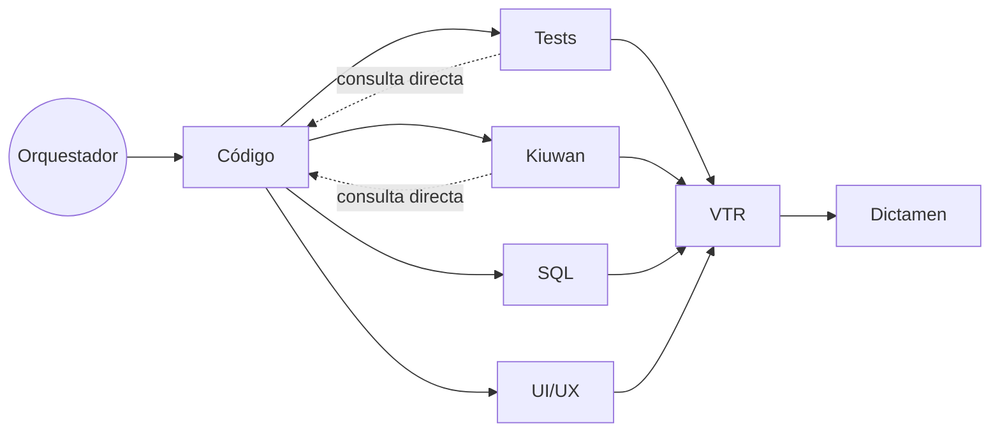
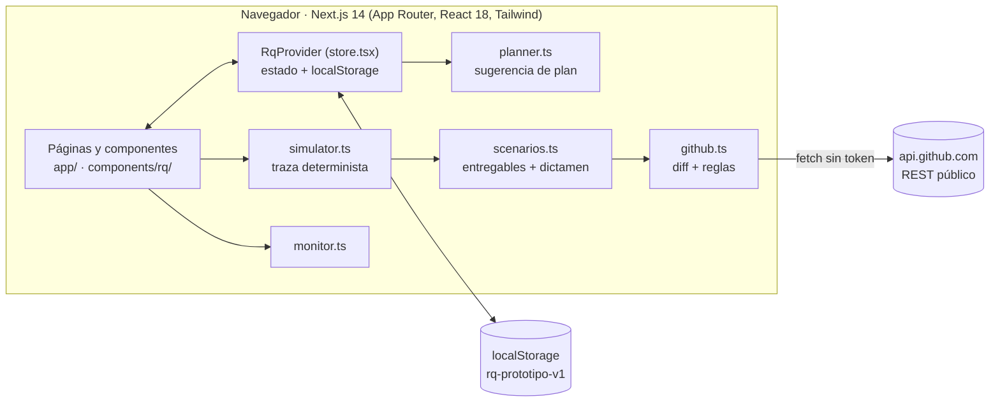

# Orquestador multiagente para revisión de requerimientos

Aplicación que **revisa el proceso de desarrollo de un requerimiento de software** con un equipo de agentes de IA.
A partir de un requerimiento y sus adjuntos (repositorio git, plantilla VTR, CSV de Kiuwan, scripts SQL), un
**orquestador** propone qué agentes especialistas deben intervenir, el usuario confirma el plan y los agentes revisan
el código, generan pruebas, analizan Kiuwan y SQL, prueban la interfaz, redactan el documento VTR y emiten un dictamen.
Todo el proceso se ve **en vivo como una traza**: qué agente trabaja, qué herramientas usa, qué mensajes se envían y cuánto cuesta.

> **Estado actual: prototipo de interfaz.** El frontend funciona **sin backend**: las ejecuciones de los agentes, los
> usuarios del Monitor y el consumo de tokens están **simulados**. Lo único real hoy es la conexión con
> **repositorios públicos de GitHub** (diff y análisis por reglas de los agentes Código y SQL).
> El backend de `backend/` todavía es la demo anterior (análisis de acciones), ver [§8](#8-backend-actual-demo-anterior).

---

## Índice

1. [Qué hace la aplicación](#1-qué-hace-la-aplicación)
2. [Requisitos](#2-requisitos)
3. [Puesta en marcha paso a paso](#3-puesta-en-marcha-paso-a-paso)
4. [Primer recorrido guiado](#4-primer-recorrido-guiado)
5. [Problemas frecuentes](#5-problemas-frecuentes)
6. [Cómo funciona técnicamente](#6-cómo-funciona-técnicamente)
7. [Estructura del repositorio](#7-estructura-del-repositorio)
8. [Backend actual (demo anterior)](#8-backend-actual-demo-anterior)
9. [Pendiente y hoja de ruta](#9-pendiente-y-hoja-de-ruta)

---

## 1. Qué hace la aplicación

### El requerimiento es el centro

```
Requerimiento (REQ-1042: título, descripción, criterios de aceptación)
 ├── Adjuntos        repositorio GitHub + rama · plantilla VTR (.docx) · CSV Kiuwan · scripts SQL
 ├── Plan            agentes sugeridos por el orquestador + activación/desactivación manual
 ├── Ejecuciones     cada una con su traza, coste y la configuración de agentes que usó
 └── Entregables     mapa del cambio · pruebas · informe Kiuwan · hallazgos SQL/UI · VTR · dictamen
```

### Los agentes

| Agente | Qué hace | Se puede desactivar |
|---|---|---|
| **Orquestador** | Lee el requerimiento y los adjuntos, sugiere qué agentes usar (con el motivo) y coordina la ejecución | No |
| **Código** | Revisa el diff de la rama y produce el **mapa del cambio** que consumen los demás agentes | Sí |
| **Tests** | Genera pruebas pequeñas a partir del mapa del cambio y los criterios, y las ejecuta en local | Sí |
| **Kiuwan** | Analiza el CSV de Kiuwan adjunto, prioriza defectos y detecta falsos positivos consultando a Código | Sí |
| **SQL** | Revisa scripts y consultas: rendimiento, seguridad y reversibilidad | Sí |
| **UI/UX** | Diseña y ejecuta escenarios Playwright sobre las pantallas afectadas | Sí |
| **VTR** | **Genera** el documento VTR rellenando la plantilla modelo con lo que produjeron los demás | Sí |
| **Dictamen** | Consolida hallazgos sin duplicados, aplica umbrales y emite `APROBADO`, `APROBADO CON OBSERVACIONES` o `RECHAZADO` | No |

Orden de ejecución:



Tests, Kiuwan, SQL y UI/UX trabajan **en paralelo** una vez que Código entrega el mapa del cambio.

### Pantallas

| Ruta | Contenido |
|---|---|
| `/` | Lista de requerimientos (adjuntos, agentes, estado, dictamen) y alta de uno nuevo |
| `/requerimiento?id=REQ-…` | Detalle por pestañas: **Requerimiento** (definición y adjuntos) · **Plan de agentes** · **Ejecución** (grafo en vivo, traza, consumo) · **Código y Tests** · **Kiuwan** · **SQL** · **UI/UX** · **VTR** · **Dictamen** |
| `/agentes` | Configuración predeterminada de cada agente: proveedor, modelo, temperatura, pasos máximos y prompt con versiones |
| `/monitor` | Usuarios en línea y dónde están, agentes trabajando ahora, llamadas, tokens, guardarraíles y coste del día |
| `/demo-bolsa` | Demo anterior (necesita el backend) |

Al **hacer clic en un agente** del grafo se abre un panel con tres pestañas: **Actividad** (qué está haciendo, paso N/M,
llamadas al modelo, herramientas con argumentos y resultado, mensajes, guardarraíles), **Resultado** y **Modelo y prompt**.

---

## 2. Requisitos

| Para | Necesitas |
|---|---|
| Ver el prototipo (recomendado) | **Node.js 20+** (probado con 22) y npm |
| Arrancar con `start-local.bat` / `start-local.sh` | **Python 3.10+** (probado con 3.12). No necesita Node si `frontend/out/` está actualizado |
| Conectar un repositorio | Acceso a internet hacia `api.github.com` y un repositorio **público** de GitHub |
| Docker (opcional) | Docker y Docker Compose |

Funciona en Windows (CMD o PowerShell), Linux y macOS.

---

## 3. Puesta en marcha paso a paso

### Paso 0 — Obtener la rama correcta

El prototipo está en la rama **`Agent-Dev`**. `git clone` y "Download ZIP" traen `main`, que **no** lo incluye.

```bash
git clone -b Agent-Dev https://github.com/centralcordoba/agentorchestrator.git
cd agentorchestrator
```

Si ya tienes el repositorio clonado:

```bash
git fetch
git checkout Agent-Dev
git pull
```

### Opción A — Modo desarrollo (recomendada para ver y modificar el prototipo)

**Windows (CMD o PowerShell):**

```cmd
cd frontend
npm install
npm run dev
```

**Linux / macOS:**

```bash
cd frontend
npm install
npm run dev
```

1. `npm install` descarga las dependencias (solo la primera vez o cuando cambie `package.json`).
2. `npm run dev` arranca Next.js en modo desarrollo con recarga automática.
3. Abre **http://localhost:3000**.

Para parar el servidor: `Ctrl+C` en esa terminal. No hace falta el backend ni ningún archivo `.env`.

### Opción B — Un solo proceso con Python (`start-local`)

Sirve la aplicación ya compilada (`frontend/out/`) desde FastAPI. Útil en máquinas sin Node.

**Windows:** doble clic en `start-local.bat` o, desde CMD en la raíz del repositorio:

```cmd
start-local.bat
```

**Linux / macOS:**

```bash
./start-local.sh
```

El script crea `backend/.venv`, instala las dependencias de Python y arranca **http://localhost:8000**
(abre el navegador automáticamente en Windows).

> **Importante:** esta opción muestra lo que haya en `frontend/out/`, que es un build **versionado**. Si cambias el
> frontend, regenera el build en una máquina con Node antes de usar esta opción:
>
> ```bash
> cd frontend
> npm run build:static
> ```
>
> y confirma la carpeta `frontend/out/` en git. Si no, verás una versión anterior de la interfaz.

Equivalente manual (Windows):

```cmd
cd backend
python -m venv .venv
.venv\Scripts\activate.bat
pip install -r requirements.txt
uvicorn app.main:app --port 8000
```

### Opción C — Docker (heredada de la demo anterior)

```bash
docker compose up --build
# frontend: http://localhost:3000   backend: http://localhost:8000/docs
```

No se ha verificado todavía con el prototipo nuevo; para ver la interfaz usa la opción A.

---

## 4. Primer recorrido guiado

La aplicación arranca con tres requerimientos de ejemplo. Para ver el flujo completo **sobre un repositorio real**:

1. En `/` pulsa **Nuevo requerimiento**, escribe título, descripción y criterios de aceptación (uno por línea) y pulsa **Crear**.
2. Pestaña **Requerimiento** → sección *Repositorio git*:
   - pega una URL pública (`https://github.com/expressjs/express`) o pulsa uno de los ejemplos, y pulsa **verificar**;
   - elige la **rama** y qué revisar: **últimos N commits** o **diferencias contra otra rama**;
   - pulsa **Conectar repositorio**. Verás commits, archivos cambiados, líneas `+/−` y hallazgos por reglas.
3. Pestaña **Plan de agentes** → **Pedir sugerencia al orquestador**. Cada agente indica si fue sugerido y por qué.
   Activa o desactiva los que quieras. Sin plantilla VTR adjunta, desactiva **VTR** (si no, la ejecución queda bloqueada).
4. Elige el **ritmo** (Rápido, Normal, Lento) y pulsa **Ejecutar revisión**.
5. Pestaña **Ejecución**: sigue el grafo en vivo y **haz clic en cualquier agente** para ver su actividad, su resultado o
   cambiar su modelo y prompt (solo para este requerimiento o como predeterminado).
6. Cuando termine, revisa **Código y Tests** (diff real con enlaces a GitHub) y **Dictamen**.
7. Abre **Monitor** para ver tu ejecución junto a la actividad (simulada) de otros usuarios.

Arriba a la derecha puedes cambiar el usuario de la sesión. Abajo, **restablecer datos de ejemplo** borra lo guardado en el navegador.

---

## 5. Problemas frecuentes

| Síntoma | Causa y solución |
|---|---|
| Veo la demo de acciones en vez del prototipo | Estás en `main` (haz `git checkout Agent-Dev`) o usas `start-local` con un `frontend/out/` sin regenerar (`npm run build:static`) |
| `npm run dev` falla con *port 3000 in use* | Ya hay otro `npm run dev` abierto (quizá de otra copia del repositorio). Ciérralo o cambia el puerto: `npx next dev -p 3001` |
| "Se alcanzó el límite de la API pública de GitHub" | La API sin autenticar permite **60 peticiones por hora por IP**; conectar un repositorio consume unas 5. Espera a la hora indicada |
| "No se encontró el repositorio" | Solo se admiten repositorios **públicos** de GitHub; revisa la URL y la rama |
| "No hay diferencias entre la base y la rama" | La base y la rama apuntan al mismo commit: usa "últimos N commits" o elige otra base |
| No puedo ejecutar la revisión | Un agente activo necesita un adjunto que falta (p. ej. VTR sin plantilla). Adjúntalo o desactiva el agente |
| Quiero empezar de cero | Pie de página → **restablecer datos de ejemplo** |

---

## 6. Cómo funciona técnicamente

### 6.1 Arquitectura del prototipo



Todas las páginas son componentes de cliente (`"use client"`). No hay llamadas a un servidor propio: el estado vive en
un contexto de React (`lib/rq/store.tsx`) que se guarda en `localStorage` y se recupera al recargar.

### 6.2 Modelo de datos (`lib/rq/types.ts`)

| Tipo | Contenido clave |
|---|---|
| `Requirement` | `id`, título, descripción, `acceptanceCriteria[]`, `attachments[]`, `plan`, `runs[]`, `profileOverrides` (ajustes de agentes solo para este requerimiento) |
| `Attachment` | `kind` (`repo`, `vtr_template`, `kiuwan_csv`, `sql`), nombre, detalle y, si se conectó a GitHub, `repo: RepoInfo` |
| `RepoInfo` | propietario, rama, base, `headSha`, commits, archivos (`path`, estado, `+/−`), lenguajes y hallazgos calculados |
| `Plan` | `items[]` con `agentId`, `suggested`, `enabled`, `reason`, y quién lo modificó |
| `Run` | `startedAt`, ritmo, agentes activos y **configuración congelada** de cada agente (proveedor, modelo, versión del prompt) |
| `TraceEvent` | `type`, `agent`, `to`, `offsetMs`, título, detalle, `data` (argumentos y resultado), tokens y coste |
| `AgentProfile` | proveedor, modelo, temperatura, `maxSteps`, prompt de sistema, plantilla de tarea, versión e historial |

### 6.3 Planificación (`lib/rq/planner.ts`)

El orquestador combina señales deterministas para sugerir agentes y justificar cada decisión:

| Agente | Se sugiere si… |
|---|---|
| Código, Tests | hay un repositorio adjunto |
| Kiuwan | hay un CSV de Kiuwan adjunto |
| SQL | el diff real contiene `.sql`, se adjuntaron scripts, o el texto menciona *tabla, consulta, migración, reporte…* |
| UI/UX | el diff real toca archivos de interfaz (`.tsx`, `.jsx`, `.vue`, `.html`, `.css`…) o el texto menciona *pantalla, formulario, portal…* |
| VTR | siempre (es obligatorio); avisa si falta la plantilla |

`planWarnings()` distingue **bloqueos** (un agente activo sin su adjunto: impide ejecutar) de **avisos**
(un agente activo cuya dependencia está desactivada: trabajará con menos contexto).

### 6.4 Ejecución simulada y determinista (`lib/rq/simulator.ts`)

Al pulsar *Ejecutar* solo se guarda el `Run` (inicio, ritmo, agentes activos y configuración). La traza **no se almacena**:
`buildTimeline()` la genera siempre igual a partir del requerimiento y del `Run`, con un generador pseudoaleatorio
sembrado con el id de la ejecución. La interfaz muestra los eventos cuyo `offsetMs` ya transcurrió desde `startedAt`.
Consecuencias: la ejecución avanza aunque cambies de página, sobrevive a recargas y se puede cancelar (`cancelledAt`).

Tipos de evento:

| Evento | Significado |
|---|---|
| `run_started` / `run_completed` | inicio y fin de la ejecución |
| `agent_started` / `agent_completed` / `agent_skipped` | ciclo de vida de cada agente (omitido = desactivado en el plan) |
| `llm_call` | un turno del modelo, con paso, tokens de entrada y salida y coste calculado con el precio del modelo |
| `tool_called` | una herramienta con argumentos y resultado (`git_diff`, `read_file`, `run_tests`, `parse_kiuwan_csv`, `playwright_run`, `render_docx`…) |
| `message_sent` | mensaje entre agentes: `task_request`, `task_result`, `info_request`/`info_response` (consulta directa) y `decision` |
| `guardrail_applied` | una regla que corrige o acota la salida (p. ej. "crítico confirmado → bloqueante") |

El estado de cada nodo del grafo (en espera, trabajando, completado, omitido), sus contadores y el coste se derivan de
esos eventos (`agentStats()`); los mensajes en vuelo se dibujan interpolando una curva de Bézier según el tiempo.

### 6.5 Conexión con GitHub y análisis por reglas (`lib/rq/github.ts`)

Llamadas a la API REST pública (sin token, desde el navegador):

| Paso | Endpoint |
|---|---|
| Verificar | `GET /repos/{owner}/{repo}`, `/branches`, `/languages` |
| Últimos N commits | `GET /repos/{owner}/{repo}/commits?sha={rama}` para obtener la base |
| Diff | `GET /repos/{owner}/{repo}/compare/{base}...{rama}` (archivos, commits y *patch* de cada archivo) |

Sobre las **líneas añadidas** de cada *patch* (se recalcula el número de línea real con las cabeceras `@@ … @@`) se aplican
reglas deterministas. Cada hallazgo guarda archivo, línea y un enlace a GitHub fijado en el `headSha`:

| Regla | Severidad | Agente |
|---|---|---|
| Posible credencial escrita en el código | Crítica | Código |
| Consulta SQL construida concatenando texto · uso de `eval` · `DELETE` sin `WHERE` | Alta | Código / SQL |
| `catch` vacío · `DROP TABLE/COLUMN/INDEX` · cambio de más de 400 líneas en un archivo · código cambiado sin archivos de prueba | Media | Código / SQL |
| Trazas de depuración (`console.log`, `System.out.println`…) · `SELECT *` | Baja | Código / SQL |
| `TODO`/`FIXME` · dependencias modificadas (`package.json`, `pom.xml`…) · diff no disponible | Info | Código |

Los *patch* no se guardan: solo los hallazgos y la lista de archivos, para no llenar `localStorage`.

### 6.6 Qué es real y qué es simulado

| Parte | Con repositorio conectado | Sin repositorio conectado |
|---|---|---|
| Mapa del cambio, commits, lenguajes | **Real** (GitHub) | Ejemplo |
| Hallazgos de Código y SQL | **Real** (reglas sobre el diff) | Ejemplo |
| Secciones 2–4 del VTR | **Real** | Ejemplo |
| Tests, Kiuwan, UI/UX, resto del VTR | Ejemplo | Ejemplo |
| Traza, tokens y coste de la ejecución | Simulados | Simulados |
| Usuarios del Monitor | Otros usuarios simulados; tus ejecuciones son las de tu sesión | Igual |

Cada pestaña lo indica con un aviso verde (*datos reales*) o amarillo (*ejemplo simulado*). Los entregables de ejemplo
provienen de dos escenarios en `lib/rq/scenarios.ts` (`pagos`: Java/Oracle; `portal`: Next.js/.NET).

### 6.7 Dictamen

`consolidatedFindings()` junta los hallazgos de los agentes completados y elimina duplicados por archivo y línea.
`buildVerdict()` aplica reglas explícitas, visibles en la pestaña Dictamen:

| Regla | Efecto |
|---|---|
| **G0** | Con repositorio real, solo cuentan Código y SQL (no se mezclan resultados de ejemplo) |
| **G1** | Algún hallazgo crítico → `RECHAZADO` |
| **G2** | Pruebas fallidas → como máximo `APROBADO CON OBSERVACIONES` |
| **G3** | Agentes clave desactivados → confianza limitada a 0,6 |

Sin críticos, altos ni pruebas fallidas → `APROBADO`.

### 6.8 Configuración de agentes y prompts (`lib/rq/agents.ts`, `components/rq/ProfileEditor.tsx`)

- Cada agente tiene un **perfil**: proveedor (OpenRouter, Claude API o mock), modelo del catálogo (con precio por millón de
  tokens), temperatura, pasos máximos, **prompt de sistema** y **plantilla de tarea** con variables (`{{requerimiento}}`, `{{mapa_cambio}}`…).
- Precedencia: ajuste del requerimiento → perfil predeterminado.
- Cambiar el prompt crea una **nueva versión** con autor, fecha y nota; se puede cargar cualquier versión anterior.
- El **contrato de salida** (esquema JSON) y las **herramientas** de cada agente se muestran pero **no se editan**: el
  consolidador y los guardarraíles dependen de ellos.
- Cada ejecución **congela** proveedor, modelo y versión del prompt (`Run.profiles`), así una ejecución antigua sigue
  mostrando con qué se hizo aunque después cambie la configuración.

### 6.9 Build estático y persistencia

- `npm run build:static` exporta la app a `frontend/out/` con `trailingSlash` (cada ruta es una carpeta con `index.html`),
  que es lo que `StaticFiles` de FastAPI sirve al recargar `/agentes`, `/monitor` o `/requerimiento/?id=…`.
- El contenido de las páginas se pinta cuando el estado ya se cargó en el navegador (`ready`), para que el HTML generado en
  el build no choque con el reloj ni con los datos de `localStorage`.
- `localStorage` usa la clave `rq-prototipo-v1`. Los datos son locales a cada navegador.

---

## 7. Estructura del repositorio

```
frontend/
  app/
    page.tsx                   lista y alta de requerimientos
    requerimiento/page.tsx     detalle por pestañas (?id=…&tab=…)
    agentes/page.tsx           configuración global de agentes
    monitor/page.tsx           panel de usuarios y agentes
    demo-bolsa/page.tsx        demo anterior
    layout.tsx · globals.css
  components/
    rq/
      AppShell.tsx             cabecera, navegación, usuario de la sesión
      FlowGraph.tsx            grafo SVG de la ejecución
      AgentPanel.tsx           panel lateral del agente (actividad, resultado, modelo y prompt)
      ProfileEditor.tsx        editor de modelo, parámetros y prompts versionados
      RepoConnector.tsx        conexión con GitHub y tarjeta del repositorio
      EventRow.tsx · ui.tsx    fila de traza y componentes base
      tabs/                    Requirement, Plan, Execution y entregables
    (resto)                    componentes de la demo anterior
  lib/
    rq/                        types, agents, store, planner, simulator, scenarios, github, derive, monitor, mockData
    (resto)                    cliente de la demo anterior
  scripts/build-static.mjs     export estático a frontend/out
  out/                         build estático versionado (lo sirve FastAPI)
backend/                       FastAPI de la demo anterior (sirve también frontend/out)
docs/                          documentación de la demo anterior
start-local.bat / .sh          arranque con Python en un solo proceso
docker-compose.yml
CLAUDE.md                      contexto y reglas para Claude Code
```

### Comprobaciones para desarrolladores

```bash
cd frontend
npx tsc --noEmit        # tipos
npx next build          # compila todas las rutas (no ejecutar con `npm run dev` abierto: comparten .next)
npm run build:static    # regenera frontend/out
```

---

## 8. Backend actual (demo anterior)

`backend/` contiene la demo educativa original: un orquestador y cinco agentes (datos de mercado, técnico, riesgo,
escéptico y decisión) que analizan símbolos bursátiles y emiten COMPRA/VENTA/ESPERAR/NO_ANALIZABLE. **No constituye
asesoramiento financiero.** Se accede desde `/demo-bolsa` con el backend en marcha. Explicación completa en
[docs/COMO_FUNCIONA.md](docs/COMO_FUNCIONA.md).

Su diseño es la base prevista para el backend del nuevo dominio:

- `Orchestrator.deliver()`: todos los mensajes entre agentes pasan por un único punto.
- `EventBus` + WebSocket (`/ws/runs/{id}`) con reenvío del historial y eventos en vivo.
- `RunStore`: ejecuciones en memoria y en `backend/runs/*.json`.
- Bucle de herramientas del LLM, validación de salidas (`services/validation.py`) y guardarraíles.
- Proveedores intercambiables: `LLM_PROVIDER` = `mock` · `openrouter` · `anthropic`.

Configuración en `backend/.env` (copia de `backend/.env.example`; **nunca subas las claves al repositorio**):

| Variable | Valores |
|---|---|
| `LLM_PROVIDER` | `mock` (defecto), `openrouter` (requiere `OPENROUTER_API_KEY`, modelo en `OPENROUTER_MODEL`), `anthropic` (requiere `ANTHROPIC_API_KEY`) |
| `MARKET_DATA_PROVIDER` | `mock` (defecto) o `yfinance` |
| `AGENT_MODE` | `llm` (defecto) o `rules` |
| `FRONTEND_DIST` | carpeta del build estático a servir (por defecto `frontend/out`) |

API principal: `POST /api/runs`, `GET /api/runs`, `GET /api/runs/{id}`, `GET /api/runs/{id}/events`,
`GET /api/runs/{id}/costs`, `WS /ws/runs/{id}`, `GET /api/health`. Documentación interactiva en `http://localhost:8000/docs`.

---

## 9. Pendiente y hoja de ruta

1. **Backend del nuevo dominio**: requerimientos, adjuntos y ejecuciones reales con LLM por agente, reutilizando el
   diseño de §8 y sustituyendo el simulador por eventos reales vía WebSocket.
2. **Formatos reales**: plantilla VTR en `doc/vtr` (generación con python-docx) y CSV de ejemplo de Kiuwan en `doc/kiwuan`.
3. **Pruebas reales**: ejecutar las pruebas generadas en un contenedor o microVM desechable, sin red.
4. **UI/UX real**: Playwright contra la aplicación del requerimiento, con dominios restringidos.
5. **Seguridad del uso de IA** (el uso previsto es con código real de la empresa): proveedor con retención cero o
   contrato empresarial, eliminación de secretos antes de enviar contexto al modelo, registro de auditoría de lo enviado,
   y herramientas de ejecución acotadas (candidatas evaluadas: CallScript, just-bash, run, emulate, deepsec).
6. Repositorios privados y otros proveedores git (GitLab, Bitbucket, servidores internos) desde el backend.
