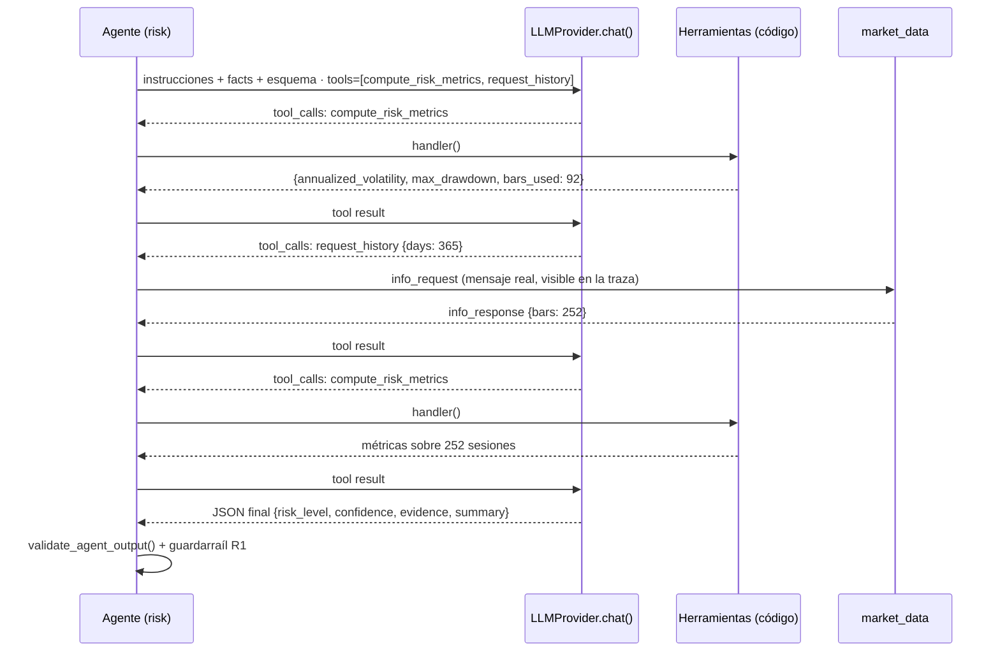
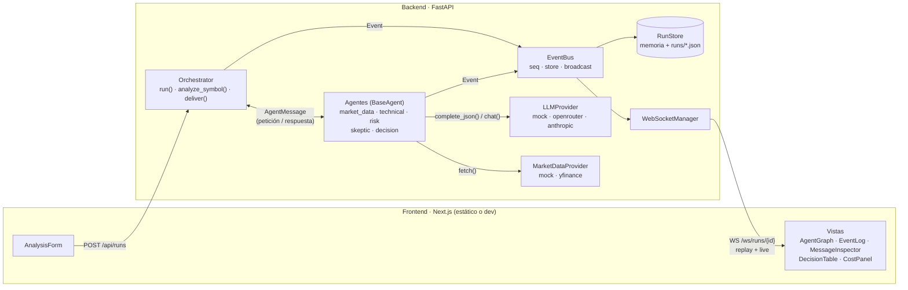
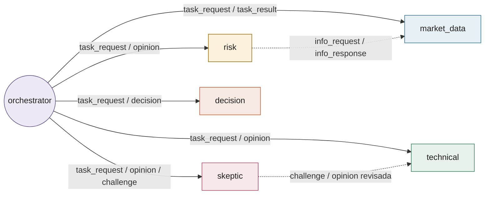
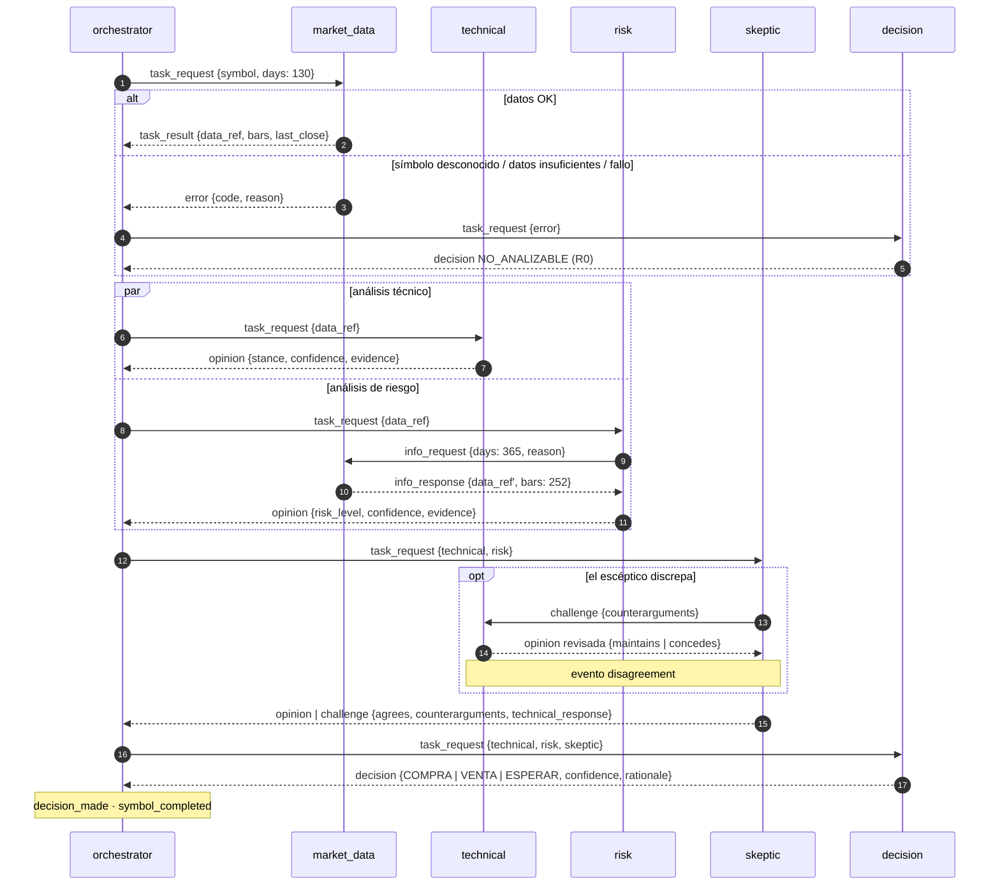
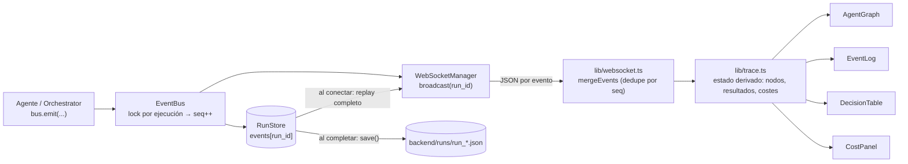
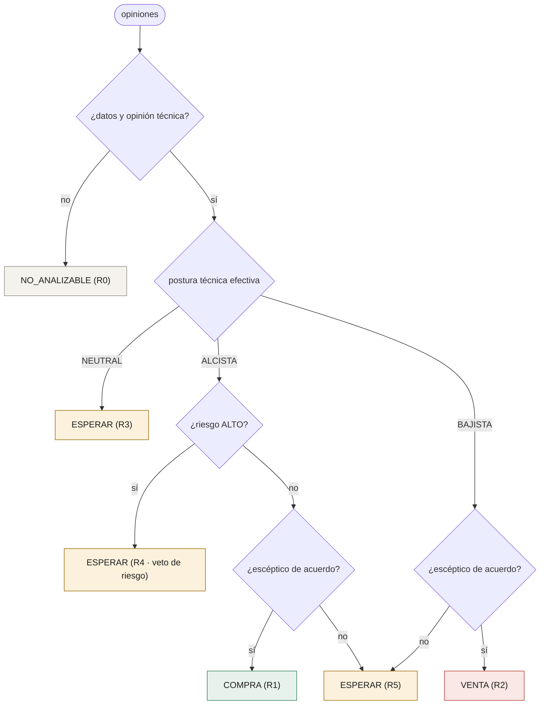
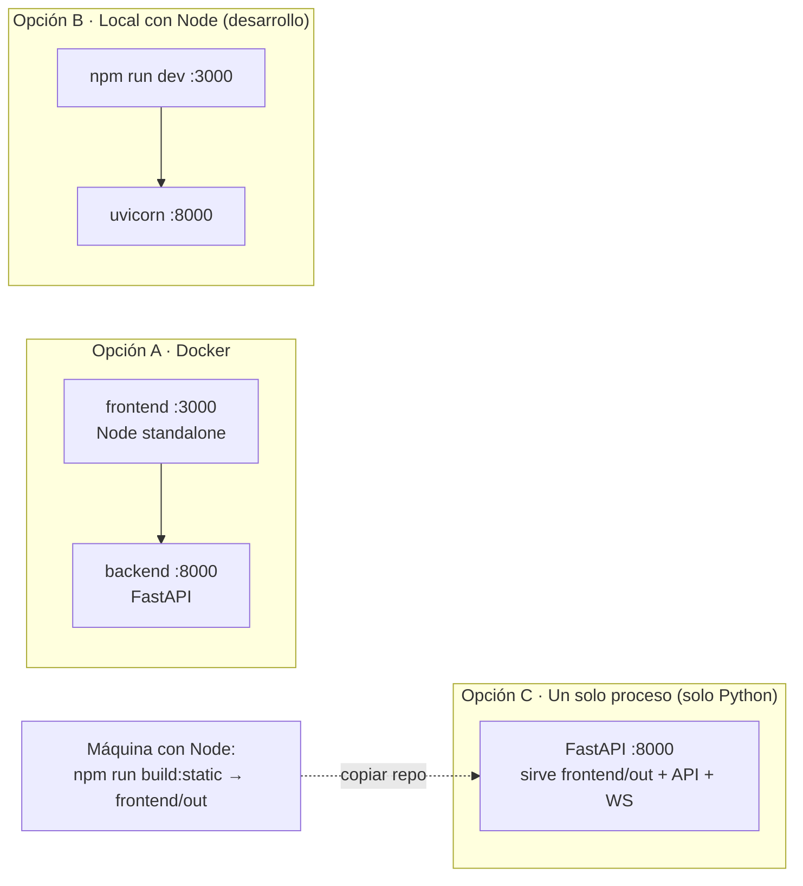

# Demo educativa: comunicación entre agentes de IA

> **Demo educativa. No constituye asesoramiento financiero ni recomendación de inversión.**
> Las clasificaciones (COMPRA / VENTA / ESPERAR / NO_ANALIZABLE) son señales experimentales derivadas
> exclusivamente de datos históricos. No se ejecutan órdenes ni existe conexión con ningún bróker.

Aplicación interna para **explicar visualmente cómo se comunican varios agentes de IA**. Recibe una lista de
símbolos bursátiles (p. ej. `["AAPL", "MSFT", "NVDA", "AMZN", "META"]`), hace pasar cada uno por un pequeño
equipo de agentes y muestra **toda la conversación entre ellos como una traza de observabilidad en tiempo real**.

El dominio (análisis técnico) es solo una excusa pedagógica: lo importante es el flujo de mensajes.

---

> Explicación paso a paso de la comunicación entre agentes (clases, mensajes, eventos, modos y guardarraíles): **[docs/COMO_FUNCIONA.md](docs/COMO_FUNCIONA.md)**.

## 1. Qué enseña la demo y dónde verlo

| # | Objetivo pedagógico | Dónde ocurre (backend) | Cómo se ve (frontend) |
|---|---|---|---|
| 1 | El orquestador inicia una ejecución | `orchestrator.py → run()` emite `run_started` y un `task_request` por símbolo | Nodo *Orquestador* en estado "trabajando"; primer evento del log |
| 2 | Un agente envía un mensaje a otro | `BaseAgent.send()` → `Orchestrator.deliver()` | Punto animado recorriendo la arista; evento `message_sent` |
| 3 | Un agente consume la salida de otro | Técnico y riesgo reciben el `data_ref` que produjo *Datos de mercado* | `in_reply_to` en el inspector (clic para saltar al mensaje origen) |
| 4 | Varios agentes trabajan en paralelo | `asyncio.gather(technical, risk)` por símbolo + semáforo entre símbolos | Técnico y riesgo "trabajando" a la vez; varios símbolos activos |
| 5 | Un agente discrepa de otro | `SkepticAgent` detecta contradicciones y envía un `challenge` directo a `TechnicalAgent`, que *mantiene* o *concede* | Evento `disagreement`, arista discontinua escéptico→técnico, columna "Escéptico" en la tabla |
| 6 | Solicitud de información adicional | `RiskAgent` necesita ≥200 sesiones; envía `info_request` a *Datos de mercado* y recibe `info_response` | Arista discontinua riesgo→datos; mensajes ámbar |
| 7 | Gestión de error / dato faltante | Proveedor lanza `SymbolNotFoundError` / `InsufficientDataError` / `MarketDataError` → mensaje `error` → `NO_ANALIZABLE` | Evento `agent_error` en rojo; fila gris en la tabla con el motivo |
| 8 | Decisión final a partir de varias opiniones | `DecisionAgent`: reglas R0–R5 (modo `rules`) o el modelo con guardarraíles G1–G4 (modo `llm`) | Columna "Justificación" + mensaje `decision` con la regla o los guardarraíles aplicados |
| 9 | Visualización en tiempo real | `EventBus` → `WebSocketManager` (replay + streaming) | Grafo, log de eventos, inspector y tabla se actualizan en vivo |

### Dos modos de agentes (`AGENT_MODE`, seleccionable por ejecución en la UI)

| | `rules` | `llm` (por defecto) |
|---|---|---|
| Quién decide | Reglas deterministas (R0–R5) | El modelo, razonando con **herramientas** |
| Papel del LLM | Solo redacta la explicación | Fija postura, riesgo, objeciones y decisión |
| Números | Código determinista | Código determinista, expuesto al modelo como herramientas (`compute_indicators`, `compute_risk_metrics`, `request_history`, `challenge_technical`) |
| Control | — | **Guardarraíles** visibles (`guardrail_applied`): T1 postura opuesta a las reglas sin evidencia, R1 riesgo subestimado, S1 discrepancia sin objeciones, G1 veto por riesgo ALTO, G2 decisión contraria al técnico, G3 discrepancia no resuelta acota la confianza, G4 NO_ANALIZABLE con datos |
| Validación | Números del resumen anclados en hechos | Además: cada `evidence.fact` debe existir; enumerados; confianza en [0,1]; textos con números inventados se sustituyen |
| Reproducible | Sí | Solo con el proveedor `mock` (sigue un guion); con un modelo real, guarda y reabre la ejecución |
| Si el LLM falla | Explicación por reglas | El agente cae al modo reglas (`mode: rules_fallback`) y lo anota |



En modo `llm`, la traza muestra cada turno del modelo (`llm_call_started/completed` con `step`), cada llamada a
herramienta con argumentos y resultado (`tool_called`) y cada corrección (`guardrail_applied`). La tabla de decisiones
indica "reglas: X" cuando el agente opinó distinto de lo que habrían dicho las reglas, y el inspector muestra la
evidencia citada. Las ejecuciones se guardan en `backend/runs/` (JSON) y se pueden reabrir desde el desplegable
"ejecuciones anteriores" o con `?run=<id>`.

### Consumo LLM (tokens y USD) por agente

El panel **Consumo LLM** de la barra lateral se actualiza en vivo con cada `llm_call_completed`: llamadas, tokens de
entrada/salida y coste en USD por agente, con una barra proporcional al consumo y el total de la ejecución. El coste se
obtiene así, en orden de prioridad:

1. **Informado por el proveedor** — OpenRouter devuelve el coste exacto de cada petición (`usage.cost`, se pide con `usage: {include: true}`).
2. **Estimado** — si el proveedor no lo informa, se estima con precios por millón de tokens: catálogo público de OpenRouter
   para el modelo en uso, tabla interna para la Claude API directa, o `LLM_PRICE_INPUT_PER_MTOK` / `LLM_PRICE_OUTPUT_PER_MTOK` si los defines.
3. **Mock** — coste 0 con tokens aproximados (≈4 caracteres/token) para que el panel se vea sin red.

Las llamadas sin precio conocido no se suman (el panel marca el total con `*`). El resumen queda en `RunSummary.costs`,
en el evento `run_completed` y en `GET /api/runs/{id}/costs`.

### Garantías de seguridad / honestidad

- **Sin broker, sin órdenes.** El único acceso externo es lectura de precios (yfinance) o un mock.
- **Nunca se inventan datos.** Los indicadores se calculan con código determinista (`services/indicators.py`).
  En modo `rules` el LLM **solo redacta** (la postura la fija la regla); en modo `llm` el modelo razona, pero
  los números le llegan exclusivamente por herramientas. `services/validation.py` comprueba que cada número de
  un texto exista en los hechos, que las evidencias citen hechos reales y que los enumerados sean válidos; si no,
  la salida se descarta o se corrige y queda anotado (`validation_warning`, `guardrail_applied`).
- **Sin datos → `NO_ANALIZABLE`.** Nunca se rellena con estimaciones.
- **Sin chain-of-thought.** Las salidas del LLM son JSON estructurado (`summary`, `facts_used`, `caveats`)
  obtenido con salida estructurada de la Claude API; no se pide ni se muestra razonamiento interno.
- **Aviso visible** en el pie de página, `/api/config` y en cada `RunSummary.disclaimer`
  (el banner superior `DisclaimerBanner` existe como componente pero está desactivado; basta importarlo en `app/page.tsx`).

---

## 2. Arquitectura

### Componentes



### Topología de comunicación

Todos los mensajes pasan por `Orchestrator.deliver()`, pero la topología lógica tiene tres formas: estrella
(orquestador ↔ agente), paralelo (técnico ‖ riesgo) y **comunicación directa entre agentes** (líneas discontinuas).



### Flujo por símbolo

Cada símbolo es una conversación independiente; hasta `MAX_PARALLEL_SYMBOLS` avanzan a la vez.



### Del evento a la pantalla



### Contrato de mensajes y eventos

`AgentMessage` (`models.py`): `id`, `run_id`, `symbol`, `sender`, `recipient`, `type`, `payload`, `in_reply_to`, `timestamp`.
Tipos: `task_request`, `task_result`, `info_request`, `info_response`, `opinion`, `challenge`, `decision`, `error`.

`Event`: `seq` (monótono por ejecución), `type`, `symbol`, `agent`, `message?`, `data`.
Tipos: `run_started/completed`, `symbol_started/completed`, `agent_started/completed/error`, `message_sent`,
`llm_call_started/completed`, `tool_called`, `validation_warning`, `guardrail_applied`, `disagreement`, `decision_made`.

### Reglas de decisión (`agents/decision_agent.py`)

| Regla | Condición | Resultado |
|---|---|---|
| R0 | sin datos o sin opinión técnica | `NO_ANALIZABLE` |
| R1 | técnico ALCISTA, riesgo ≠ ALTO, escéptico de acuerdo | `COMPRA` |
| R2 | técnico BAJISTA, escéptico de acuerdo | `VENTA` |
| R3 | técnico NEUTRAL (o rebajado a neutral tras el reto) | `ESPERAR` |
| R4 | técnico ALCISTA con riesgo ALTO | `ESPERAR` (veto de riesgo) |
| R5 | el escéptico discrepa y la discrepancia no se resuelve | `ESPERAR` |



En modo `llm` el mismo árbol no decide: actúa como **referencia** (`rule_reference`) y como guardarraíl
(G1 ≈ R4, G2 ≈ coherencia con la postura, G3 ≈ R5 acotando la confianza).

Postura técnica: puntuación −4..+4 a partir de cierre vs SMA50, SMA20 vs SMA50, RSI(14) y histograma MACD.
Riesgo: volatilidad anualizada, drawdown máximo y ATR(14) sobre ≥200 sesiones.

---

## 3. Estructura del repositorio

```
backend/
  app/
    main.py                 API REST + WebSocket
    config.py               variables de entorno
    models.py               mensajes, eventos, resultados (pydantic)
    events.py               EventBus (seq + store + broadcast)
    websocket_manager.py    conexiones WS por ejecución
    orchestrator.py         coordinación y enrutado de mensajes
    agents/                 base_agent, market_data, technical, risk, skeptic, decision
    providers/              llm_provider (+ anthropic, mock), market_data_provider (+ yfinance, mock)
    services/               indicators, validation, run_store
  requirements.txt · .env.example · Dockerfile
frontend/
  app/                      page.tsx, layout.tsx, globals.css
  components/               AnalysisForm, AgentGraph, AgentNode, EventLog, DecisionTable, MessageInspector, DisclaimerBanner (desactivado)
  lib/                      api.ts, websocket.ts, types.ts, trace.ts (derivación de estado a partir de eventos)
  scripts/build-static.mjs  exporta el frontend a HTML estático (frontend/out)
  package.json · Dockerfile
docker-compose.yml
start-local.bat / .sh       arranque "un solo proceso" (solo Python) en la máquina de destino
```

---

## 4. Puesta en marcha



### Opción A — Docker (todo en modo mock, sin claves)

```bash
docker compose up --build
# frontend: http://localhost:3000   backend: http://localhost:8000/docs
```

### Opción B — Local con Node (desarrollo)

Backend (Python 3.12):

```bash
cd backend
python -m venv .venv && . .venv/bin/activate      # Windows: .venv\Scripts\activate
pip install -r requirements.txt
cp .env.example .env                              # opcional
uvicorn app.main:app --reload --port 8000
```

Frontend (Node 20+):

```bash
cd frontend
npm install
cp .env.example .env.local                        # NEXT_PUBLIC_API_URL=http://localhost:8000
npm run dev
```

### Opción C — Un solo proceso, sin Docker ni Node en destino (recomendada para máquinas con pocos permisos)

El frontend se exporta a HTML/JS estático y **FastAPI lo sirve junto con la API** en `http://localhost:8000`.
En la máquina de destino solo hace falta **Python 3.10+** (una instalación de usuario basta; todo escucha en
`127.0.0.1`, sin abrir puertos ni permisos de administrador). Con los proveedores `mock` no necesita internet.

**1. En una máquina con Node (una sola vez, o cada vez que cambie el frontend):**

```bash
cd frontend
npm install
npm run build:static          # genera frontend/out/ (API en el mismo origen, sin NEXT_PUBLIC_API_URL)
```

**2. (Opcional, si el destino no tiene internet) preparar las dependencias de Python:**

```bash
cd backend
pip download -r requirements.txt -d wheels   # misma versión de Python y mismo SO que el destino
```

**3. Copiar el repositorio al destino** (incluyendo `frontend/out/` y, si procede, `backend/wheels/`;
no hace falta `node_modules` ni `.next`). Por zip, carpeta compartida o git. Si usas git, **haz commit de
`frontend/out/`** después de cada `build:static` (está versionado a propósito; `backend/wheels/` no, por tamaño:
cópialo a mano). Comprueba en el destino que existe `frontend/out/index.html`.

**4. En el destino:**

```
start-local.bat      (Windows)          ./start-local.sh   (Linux/macOS)
```

El script crea `backend/.venv`, instala dependencias (desde `wheels/` si existe, si no desde PyPI) y arranca
`uvicorn` en http://localhost:8000 con la UI y la API. Equivalente manual:

```bash
cd backend
python -m venv .venv && .venv\Scripts\activate     # Linux: source .venv/bin/activate
pip install -r requirements.txt                      # o: pip install --no-index --find-links wheels -r requirements.txt
uvicorn app.main:app --port 8000
```

Notas:
- Si `frontend/out/index.html` no existe, el backend arranca igualmente, lo avisa en el log y muestra en `/` una
  página de ayuda con la ruta en la que buscó el build (solo API). Causas típicas: no se hizo commit/copia de
  `frontend/out/` tras `build:static`, o se copió solo la carpeta `backend/` (en ese caso define `FRONTEND_DIST`).
- `FRONTEND_DIST` permite apuntar a otra carpeta con el build estático.
- Para Python sin instalador (sin permisos): el *Windows embeddable package* de python.org funciona, pero no trae
  `pip` ni `venv`; en ese caso instala con `python get-pip.py --user` y ejecuta `python -m uvicorn ...` directamente.

### Proveedores

| Variable | Valores | Notas |
|---|---|---|
| `LLM_PROVIDER` | `mock` (defecto) · `openrouter` · `anthropic` | `openrouter` requiere `OPENROUTER_API_KEY` y acepta cualquier modelo del catálogo (`OPENROUTER_MODEL`, por defecto `anthropic/claude-sonnet-4.6`). `anthropic` usa la Claude API directa (`ANTHROPIC_API_KEY` o perfil de `ant auth login`, modelo `claude-opus-5`, `ANTHROPIC_EFFORT=low`). En ambos casos el LLM **solo redacta** las explicaciones. |
| `LLM_MAX_CONCURRENCY` | entero | Llamadas LLM simultáneas como máximo (defecto 4); protege límites de tasa. |
| `AGENT_MODE` | `llm` (defecto) · `rules` | Modo de los agentes por defecto (ver tabla de modos). |
| `LLM_PRICE_INPUT_PER_MTOK` / `LLM_PRICE_OUTPUT_PER_MTOK` | USD | Precios manuales para estimar el coste cuando el proveedor no lo informa (opcional). |
| `AGENT_MAX_STEPS` | entero | Turnos máximos del modelo por agente y tarea en modo `llm` (defecto 8). |
| `RUNS_DIR` | ruta | Carpeta de persistencia de ejecuciones (defecto `backend/runs`; vacío = solo memoria). |
| `MARKET_DATA_PROVIDER` | `mock` (defecto) · `yfinance` | `yfinance` descarga precios diarios reales de Yahoo Finance (solo lectura; `days` son días naturales: 130 → ~90 sesiones, 365 → ~252). Probado con `AAPL`, `NVDA`, `SAN.MC` (EUR) y un símbolo inexistente → `NO_ANALIZABLE`. La primera descarga puede tardar 20-30 s (arranque en frío de yfinance); las siguientes, 1-2 s. Sin SLA ni garantía de disponibilidad. |
| `DEMO_DELAY_MS` | ms | Latencia simulada de los proveedores mock (LLM y datos). |
| `MESSAGE_DELAY_MS` | ms (0-5000) | Retardo aplicado a **cada mensaje entre agentes** (ida y vuelta) para seguir el flujo en el grafo. Valor por defecto; el formulario permite elegir el ritmo por ejecución (Rápido 0 · Normal 800 · Lento 1500 · Muy lento 3000) y la animación del grafo se ajusta a él. |
| `MAX_PARALLEL_SYMBOLS` | entero | Símbolos analizados simultáneamente. |

#### Usar OpenRouter

```bash
# backend/.env  (se carga automáticamente al arrancar; nunca lo subas al repo)
LLM_PROVIDER=openrouter
OPENROUTER_API_KEY=sk-or-v1-...          # https://openrouter.ai/keys
OPENROUTER_MODEL=anthropic/claude-sonnet-4.6
```

Al arrancar, la cabecera de la UI muestra `LLM · openrouter:<modelo>` y cada evento `llm_call_completed` incluye
tokens, modelo y proveedor upstream que sirvió la petición. El proveedor pide salida estructurada
(`response_format: json_schema` + `provider.require_parameters`); si el modelo elegido no la soporta, reintenta con
`json_object` y, en último término, extrae el JSON del texto. Errores de clave (401), crédito (402), modelo (404),
límite de tasa (429) o proveedor caído se anotan en la traza y el agente continúa con la explicación por reglas.

Coste orientativo por ejecución de 5 símbolos en modo `rules` (≈20 llamadas de ~1,5k tokens de entrada y ~250 de salida; en modo `llm` cuenta con 2–3× más llamadas por los turnos de herramientas):
`anthropic/claude-sonnet-4.6` ≈ 0,11 $ · `anthropic/claude-haiku-4.5` ≈ 0,04 $ · `openai/gpt-4o-mini` ≈ 0,01 $.
Modelos baratos con salida estructurada que funcionan bien para redactar: `anthropic/claude-haiku-4.5`,
`google/gemini-2.5-flash`, `openai/gpt-4.1-mini`.

Con `LLM_PROVIDER=anthropic` se usa salida estructurada (`output_config.format` JSON Schema) y, por defecto,
fallback en servidor ante un `stop_reason: refusal` (`ANTHROPIC_ENABLE_FALLBACKS`). Si el LLM falla o su
resumen no supera la validación, el agente sigue funcionando con la explicación generada por reglas y lo
deja registrado en la traza.

### Casos de demostración con el proveedor mock

Las series del mock son sintéticas y deterministas (misma semilla → misma serie), así que los resultados
son reproducibles en clase:

| Entrada | Resultado esperado | Qué ilustra |
|---|---|---|
| `AAPL` | ESPERAR (R3) | Lectura técnica neutral |
| `MSFT` | VENTA (R2) | Técnico bajista, escéptico de acuerdo |
| `NVDA` | ESPERAR (R4) | Técnico alcista **pero** riesgo ALTO → el escéptico discrepa, el técnico mantiene, veto de riesgo |
| `AMZN` | COMPRA (R1) | Técnico alcista, riesgo medio, sin objeciones |
| `META` | ESPERAR (R3) | Técnico bajista con RSI en sobreventa → el escéptico reta y el técnico **concede** (rebaja a neutral) |
| `TSLA`, `SAN.MC` | ESPERAR | Discrepancia por riesgo ALTO (TSLA además con momento negativo) |
| `GOOGL`, `NFLX`, `SPY` | COMPRA | Variantes de R1 (SPY con riesgo BAJO) |
| `INTC`, `IBE.MC` | VENTA | Variantes de R2 |
| `XYZ123` | NO_ANALIZABLE | Símbolo desconocido → `symbol_not_found` |
| `NODATA` | NO_ANALIZABLE | Serie con muy pocas sesiones → `insufficient_data` |
| `FAIL` | NO_ANALIZABLE | Fallo simulado del proveedor → `provider_error` |

Presets del formulario (válidos con `mock` y con `yfinance`): **Cartera big tech** (`AAPL, MSFT, NVDA, AMZN, META`) y
**Discrepancias y errores** (`TSLA, META, XYZ123`: riesgo alto con reto del escéptico, técnico que concede y símbolo
inexistente). Una ejecución puede reabrirse con `http://localhost:3000/?run=<run_id>`.

Símbolos conocidos por el mock: AAPL, AMD, AMZN, GOOGL, IBE.MC, INTC, JPM, KO, META, MSFT, NFLX, NVDA, SAN.MC, SPY, TSLA, XOM.

---

## 5. API

| Método | Ruta | Descripción |
|---|---|---|
| `POST` | `/api/runs` | `{"symbols": ["AAPL", ...], "message_delay_ms": 1500}` (opcional, 0-5000) → `202 {run_id, symbols, rejected, message_delay_ms}` |
| `GET` | `/api/runs` | Lista de ejecuciones |
| `GET` | `/api/runs/{run_id}` | Resumen y resultados |
| `GET` | `/api/runs/{run_id}/events?after=0` | Eventos (auditoría / replay) |
| `GET` | `/api/runs/{run_id}/costs` | Consumo LLM por agente (tokens y USD) |
| `WS` | `/ws/runs/{run_id}` | Reenvía el historial y luego los eventos nuevos |
| `GET` | `/api/health` · `/api/config` · `/api/agents` | Estado, proveedores activos y catálogo de agentes |

Documentación interactiva: `http://localhost:8000/docs`.

---

## 6. Cómo extender la demo

- **Nuevo agente:** hereda de `BaseAgent`, implementa `process(message) -> AgentMessage`, regístralo en
  `Orchestrator.agents` y añade su posición en `components/AgentGraph.tsx` (`POS`).
- **Nuevo tipo de mensaje:** amplía `MessageType` en `models.py` y `lib/types.ts`.
- **Otro proveedor LLM:** implementa `LLMProvider.complete_json()`; la validación anti-invención es común.
- **Persistencia:** sustituye `RunStore` (memoria) por una base de datos manteniendo la interfaz.
