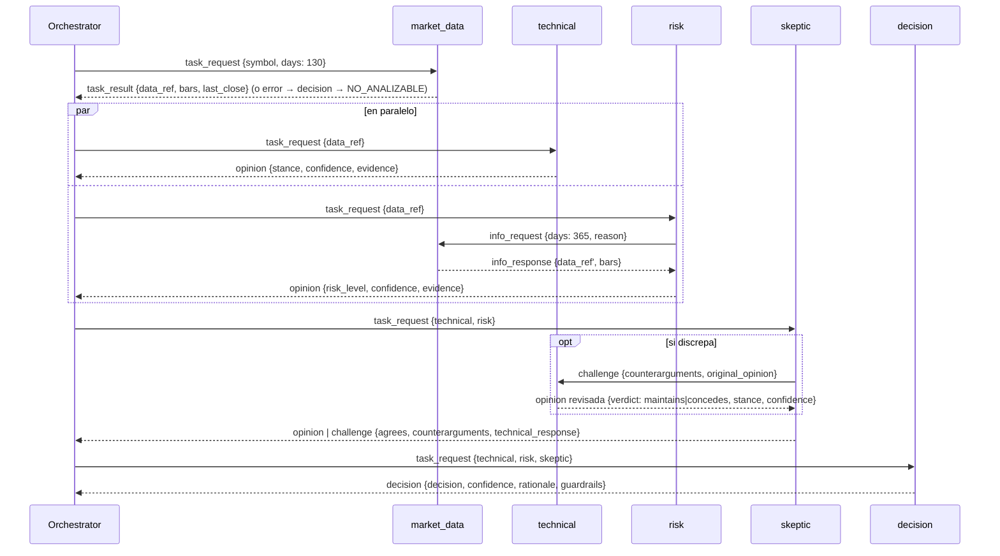
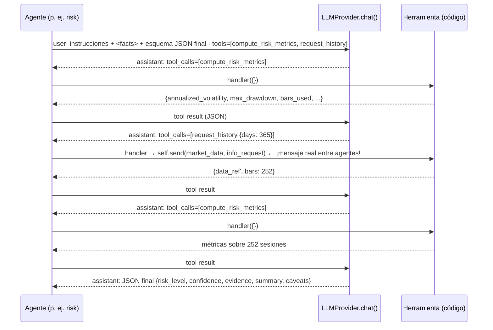

# Cómo funciona: la comunicación entre agentes, paso a paso

> Documento de referencia para explicar la demo. Cada sección tiene dos planos: **la idea** (qué
> ocurre conceptualmente) y **la implementación** (qué clase, método y archivo lo hace).
> El dominio (analizar acciones) es solo una excusa: lo importante es *cómo hablan los agentes*.

---

## 0. El modelo mental en una página

```
                        ┌──────────────────────────────────────────────────────────┐
  POST /api/runs  ───▶  │ Orchestrator                                              │
                        │   run()            inicia la ejecución, un símbolo cada vez│
                        │   analyze_symbol() guion de conversación por símbolo      │
                        │   deliver()        ÚNICO canal por el que viaja un mensaje│
                        └───────┬───────────────────────────────────────┬──────────┘
                                │ AgentMessage                          │ Event
                                ▼                                       ▼
   ┌────────────┐  ┌───────────┐  ┌──────┐  ┌─────────┐  ┌──────────┐   EventBus ──▶ RunStore (memoria + JSON)
   │market_data │  │ technical │  │ risk │  │ skeptic │  │ decision │            └─▶ WebSocketManager ──▶ UI
   └────────────┘  └───────────┘  └──────┘  └─────────┘  └──────────┘
         ▲              ▲  ▲          │           │
         └──────────────┼──┼──────────┘           │   comunicación DIRECTA entre agentes
                        └──┼──────────────────────┘   (info_request, challenge)
```

Cinco ideas que sostienen todo el diseño:

1. **Un agente es un objeto con un buzón**: recibe un `AgentMessage`, hace algo y devuelve otro `AgentMessage`.
2. **Todo mensaje pasa por un único punto** (`Orchestrator.deliver`). Ahí se registra, se retrasa artificialmente
   para que se vea, y se entrega. No hay "atajos" invisibles entre agentes.
3. **Los mensajes son datos, los eventos son observación.** Un mensaje cambia el estado de la conversación; un
   evento solo cuenta que algo ocurrió. La UI se construye íntegramente a partir de los eventos.
4. **Los números nunca salen del modelo.** Indicadores, volatilidad, drawdown… los calcula código determinista.
   El LLM redacta (modo reglas) o razona sobre ellos usando herramientas (modo llm), pero no los inventa: una
   capa de validación descarta cualquier número que no exista en los hechos.
5. **Las reglas siempre están presentes**: deciden (modo `rules`) o vigilan como guardarraíles (modo `llm`).

---

## 1. Las piezas y quién es quién

| Pieza | Clase / módulo | Responsabilidad |
|---|---|---|
| Contrato de mensaje | `AgentMessage` — `backend/app/models.py` | Sobre inmutable: `id`, `sender`, `recipient`, `type`, `payload`, `in_reply_to`, `symbol`, `timestamp`. |
| Contrato de evento | `Event` — `models.py` | `seq` monótono por ejecución, `type`, `agent`, `symbol`, `message?`, `data`. |
| Coordinador | `Orchestrator` — `orchestrator.py` | Arranca la ejecución, ejecuta el guion por símbolo, enruta mensajes, agrega resultados. |
| Base de agente | `BaseAgent` — `agents/base_agent.py` | Ciclo de vida (`handle` → `process`), envío (`send`), explicación por LLM (`explain`), bucle con herramientas (`run_agent_loop`). |
| Contexto compartido | `AgentContext` — `base_agent.py` | Lo que todo agente necesita: `bus`, `llm`, `market`, `settings`, `deliver`, `agent_mode`, `data` (series por referencia). |
| Agentes | `MarketDataAgent`, `TechnicalAgent`, `RiskAgent`, `SkepticAgent`, `DecisionAgent` — `agents/*.py` | Cada uno implementa `process()`. |
| Bus de eventos | `EventBus` — `events.py` | Asigna `seq`, guarda en `RunStore`, difunde por WebSocket. |
| Transporte a la UI | `WebSocketManager` — `websocket_manager.py` | Una conexión por espectador y ejecución; replay + streaming. |
| Memoria | `RunStore` — `services/run_store.py` | Ejecuciones y eventos en memoria, persistidos en `backend/runs/*.json`. |
| Proveedores | `LLMProvider` (+ `MockLLMProvider`, `OpenRouterProvider`, `AnthropicProvider`) y `MarketDataProvider` (+ mock, yfinance) — `providers/` | Lo único que habla con el exterior. Intercambiables por configuración. |
| Cálculo | `services/indicators.py` | SMA, RSI, MACD, ATR, volatilidad, drawdown. Python puro, determinista. |
| Validación | `services/validation.py` | "No inventar datos": números anclados, evidencias reales, enumerados, confianza acotada. |
| Costes | `services/costs.py` | Suma tokens y USD por agente a partir de los eventos. |

Los agentes se identifican con el enumerado `AgentName` (`orchestrator`, `market_data`, `technical`, `risk`,
`skeptic`, `decision`). El orquestador está en la lista porque **también envía y recibe mensajes**, aunque no
sea un `BaseAgent`.

---

## 2. Vocabulario de mensajes y eventos

### 2.1 Tipos de mensaje (`MessageType`) — *lo que un agente le dice a otro*

| Tipo | Significado | Quién lo usa |
|---|---|---|
| `task_request` | "Haz esta tarea" | orchestrator → cualquier agente |
| `task_result` | Resultado de una tarea sin opinión (datos) | market_data → orchestrator |
| `info_request` | "Necesito más información" | risk → market_data |
| `info_response` | Respuesta a una petición de información | market_data → risk |
| `opinion` | Postura de un analista (stance / risk_level / agrees) | technical, risk, skeptic → orchestrator; technical → skeptic |
| `challenge` | Discrepancia con objeciones | skeptic → technical; skeptic → orchestrator (cuando discrepa) |
| `decision` | Clasificación final | decision → orchestrator |
| `error` | Fallo o dato faltante, con `code` y `reason` | cualquier agente → quien preguntó |

Regla de oro: **cada petición tiene exactamente una respuesta**, y la respuesta lleva `in_reply_to` con el `id`
de la petición. Eso permite reconstruir hilos de conversación en la UI (el inspector tiene un enlace
"responde a").

### 2.2 Tipos de evento (`EventType`) — *lo que se observa desde fuera*

| Grupo | Eventos |
|---|---|
| Ejecución | `run_started`, `run_completed`, `symbol_started`, `symbol_completed` |
| Agentes | `agent_started`, `agent_completed`, `agent_error` |
| Mensajes | `message_sent` (uno por cada `AgentMessage`, petición o respuesta) |
| LLM | `llm_call_started`, `llm_call_completed`, `tool_called`, `validation_warning` |
| Razonamiento | `disagreement`, `guardrail_applied`, `decision_made` |

Un evento `message_sent` **contiene el mensaje completo** (`event.message`). Por eso la traza es suficiente para
auditar todo lo que se dijeron los agentes: no hay canal lateral.

---

## 3. Ciclo de vida de una ejecución, paso a paso

### Paso 1 — La petición HTTP crea un orquestador

`POST /api/runs {"symbols": [...], "agent_mode": "llm", "message_delay_ms": 800}` (`main.py → create_run`):

1. `normalize_symbols()` limpia y deduplica; los rechazados vuelven en la respuesta.
2. Se crea un `Orchestrator` con sus cinco agentes, **compartiendo un solo `AgentContext`**.
3. Se registra un `RunSummary` en el `RunStore` y se lanza `orchestrator.run()` como tarea en segundo plano.
4. Se responde `202 {run_id}` inmediatamente: el cliente abre `WS /ws/runs/{run_id}` para mirar.

> Idea: crear la ejecución y observarla son dos cosas distintas. La API no espera al resultado.

### Paso 2 — `run()`: inicio y paralelismo entre símbolos

```python
# orchestrator.py (simplificado)
await bus.emit(RUN_STARTED, data={symbols, agent_mode, message_delay_ms, ...})
semaphore = asyncio.Semaphore(settings.max_parallel_symbols)   # 3 por defecto
await asyncio.gather(*(guarded(symbol) for symbol in symbols))  # guarded = semáforo + cortafuegos
...
run.costs = summarize_costs(events)
await bus.emit(RUN_COMPLETED, data={results, costs})
```

- Cada símbolo es una **conversación independiente** que corre como corrutina; el semáforo limita cuántas van a la vez.
- `guarded()` envuelve `analyze_symbol()` en un `try/except` de último recurso: un símbolo nunca deja de tener resultado.
- Todos los agentes son **instancias únicas compartidas** entre símbolos. Por eso no guardan estado en `self`
  durante una tarea: el estado vive en variables locales/cierres (ver `RiskAgent._analyze_llm → state`).

### Paso 3 — `analyze_symbol()`: el guion de la conversación

Es el único sitio donde está escrito "quién habla con quién y en qué orden":



Observa los tres patrones de comunicación que conviven:

| Patrón | Dónde | Por qué importa |
|---|---|---|
| **Hub (estrella)** | orchestrator ↔ cada agente | El coordinador conoce el flujo; los agentes no necesitan conocerse. |
| **Paralelo** | technical ‖ risk | `asyncio.gather` sobre dos `deliver()`; ambos consumen la *misma* salida de market_data. |
| **Directo (peer-to-peer)** | risk → market_data, skeptic → technical | Un agente pide algo a otro **sin pasar por el orquestador como decisor**, pero sí por `deliver()`, así sigue siendo visible (aristas discontinuas en el grafo). |

### Paso 4 — `deliver()`: el canal

```python
async def deliver(self, message):
    await self.bus.emit_message(message)     # 1. se hace visible ANTES de viajar
    await self._transit()                    # 2. latencia simulada (message_delay_ms)
    target = self.agents[message.recipient]  # 3. enrutado por nombre
    response = await target.handle(message)  # 4. el destinatario procesa y responde
    await self.bus.emit_message(response)    # 5. la respuesta también se hace visible
    await self._transit()                    # 6. ... y también viaja
    return response
```

Es deliberadamente simple: **síncrono en forma de petición-respuesta**. No hay colas ni suscripciones; la
asincronía viene de que varias conversaciones (`analyze_symbol`) avanzan a la vez en el event loop.
`BaseAgent.send()` no es más que `await ctx.deliver(message)`, de modo que un agente que "habla" con otro usa
exactamente el mismo camino que el orquestador.

### Paso 5 — `handle()`: qué hace un agente al recibir un mensaje

```python
async def handle(self, message):
    emit(AGENT_STARTED)                     # "he recibido X de Y"
    try:
        response = await self.process(message)   # lógica propia del agente
    except Exception as e:
        emit(AGENT_ERROR); return self.error_reply(message, ...)
    emit(AGENT_ERROR if response.type == ERROR else AGENT_COMPLETED)
    return response
```

`process()` es lo único que cada agente implementa. Convenciones:

- `self.reply(to, type, payload)` construye la respuesta con `in_reply_to` y `symbol` ya rellenos.
- `self.error_reply(to, reason, code=...)` es la forma canónica de decir "no puedo": nunca se lanza una excepción
  hacia fuera si se puede responder con un `error`.
- Los datos voluminosos (series de precios) **no viajan en el payload**: `MarketDataAgent` los deja en
  `ctx.data[data_ref]` y el mensaje lleva solo `data_ref` y un resumen. Así la traza sigue siendo ligera y los
  agentes consumen "la salida de otro" por referencia.

### Paso 6 — Cierre del símbolo y de la ejecución

`_build_result()` convierte el mensaje `decision` en un `SymbolResult` (decisión, confianza, opiniones, datos
usados, discrepancias) y `_finish_symbol()` emite `decision_made` + `symbol_completed`. Al terminar todos los
símbolos, `run()` calcula los costes, marca la ejecución como completada (lo que dispara `RunStore.save()` →
`backend/runs/<run_id>.json`) y emite `run_completed`.

---

## 4. Dentro de cada agente: qué decide y con qué

| Agente | Entrada | Cálculo determinista (herramienta) | Salida | Modo `rules` | Modo `llm` |
|---|---|---|---|---|---|
| `MarketDataAgent` | `symbol, days` | `MarketDataProvider.fetch()` + validación de integridad | `task_result` / `info_response` / `error` | igual | igual (no usa LLM) |
| `TechnicalAgent` | `data_ref` | `indicator_facts()`: SMA20/50, RSI14, MACD, retorno 20d | `opinion {stance, confidence, evidence}` | `rule_stance()` (puntuación −4..+4) + LLM redacta | LLM llama `compute_indicators` y fija postura; guardarraíl T1 |
| `RiskAgent` | `data_ref` | `risk_metrics()`: volatilidad, drawdown, ATR | `opinion {risk_level, ...}` | umbral de sesiones → `info_request`; `rule_risk_level()` | LLM decide cuándo llamar `request_history`; guardarraíl R1 |
| `SkepticAgent` | opiniones técnica y de riesgo | `find_counterarguments()` (RSI extremo, confianza baja, riesgo alto, momento contrario) | `opinion` o `challenge` | objeciones por reglas → `challenge` al técnico | LLM decide objeciones y usa `challenge_technical`; guardarraíl S1 |
| `DecisionAgent` | todas las opiniones | `decide()` (R0–R5) | `decision` | la regla decide; LLM redacta | LLM propone; `decide()` es referencia; guardarraíles G1–G4 |

La **postura técnica efectiva** que usa la decisión es la revisada tras el reto, si lo hubo
(`effective_technical()` en `decision_agent.py`).

---

## 5. Cómo habla un agente con el modelo

### 5.1 Modo `rules`: el LLM como redactor (`BaseAgent.explain`)

```
facts (dict de números ya calculados) ──▶ LLMProvider.complete_json(LLMRequest)
                                               │  JSON {summary, facts_used, caveats}
                                               ▼
                                   validate_explanation(output, facts)
                                     · facts_used ⊆ facts
                                     · todo número del summary existe en facts
                                               │
                       OK ─────────────────────┴───────────── fallo/aviso grave
                        ▼                                           ▼
              explanation (generated_by=modelo)        explanation por plantilla (generated_by=rules)
```

La postura la ha fijado la regla **antes** de llamar al modelo; el prompt lo dice explícitamente
(`SYSTEM_PROMPT` en `providers/llm_provider.py`: "no cambies la postura; solo explícala").

### 5.2 Modo `llm`: el agente razona con herramientas (`BaseAgent.run_agent_loop`)



Detalles que conviene contar:

- **La conversación con el modelo es local al agente**: `messages` es una lista en memoria que crece con cada
  turno (`ChatMessage` de rol `user` / `assistant` / `tool`). Nunca se comparte entre agentes; lo único que
  un agente exporta es su mensaje de salida.
- **`Tool` = `ToolSpec` (nombre, descripción, JSON Schema) + `handler` (corrutina Python)**. Algunos handlers
  solo calculan; otros **envían mensajes a otros agentes** (`request_history`, `challenge_technical`). Así el
  modelo "decide hablar con alguien" y esa decisión se materializa como un `AgentMessage` normal y visible.
- Cada turno emite `llm_call_started/completed` (con `step`, tokens y coste) y cada herramienta `tool_called`
  (argumentos y resultado). `known_facts` acumula hechos iniciales + resultados de herramientas: ese es el
  universo contra el que se valida después.
- Si el modelo no responde en `AGENT_MAX_STEPS` turnos, o el proveedor falla, se lanza `LLMError` y el agente
  **cae al modo reglas** (`mode: rules_fallback`), dejándolo anotado. La ejecución nunca se bloquea por el LLM.

### 5.3 Validación y guardarraíles (`services/validation.py` + cada agente)

`validate_agent_output()` devuelve `(clean, warnings, hard_errors)`:

- *hard*: enumerado inválido (p. ej. `stance: "MUY ALCISTA"`) → se descarta la salida → fallback a reglas.
- *warnings*: evidencia sobre hechos inexistentes (se elimina), confianza fuera de [0,1] (se acota), números
  del texto no anclados (el texto se sustituye por uno construido con la evidencia validada). Los porcentajes
  nunca se eximen: "subirá un 80 %" sin un hecho `0.8` detrás se descarta.

Después, cada agente aplica sus guardarraíles y emite `guardrail_applied {rule, before, after, reason}`:

| Regla | Agente | Condición → corrección |
|---|---|---|
| T1 | technical | postura opuesta a las reglas con < 2 evidencias → NEUTRAL, confianza ≤ 0.4 |
| T2 / T3 | technical | "mantiene" pero cambia de postura / "concede" sin bajar confianza → se corrige |
| R1 | risk | riesgo dos niveles por debajo de las reglas → nivel de las reglas |
| S1 | skeptic | `agrees: false` sin objeciones → `agrees: true` |
| G1 | decision | COMPRA con riesgo ALTO → ESPERAR |
| G2 | decision | COMPRA sin postura efectiva ALCISTA / VENTA sin BAJISTA → ESPERAR |
| G3 | decision | escéptico discrepa y técnico mantiene → confianza ≤ 0.5 |
| G4 | decision | NO_ANALIZABLE con datos disponibles → ESPERAR |

Cada opinión conserva `rule_reference` ("qué habrían dicho las reglas"), que la UI muestra como `= reglas` o
`reglas: X` para comparar modelo y reglas sin tener que repetir la ejecución.

### 5.4 Los proveedores: una interfaz, tres implementaciones

```python
class LLMProvider(ABC):
    async def complete_json(request: LLMRequest) -> dict          # modo rules
    async def chat(*, task, system, messages, tools, schema) -> LLMTurn   # modo llm
```

| Implementación | `complete_json` | `chat` (herramientas) | Coste |
|---|---|---|---|
| `MockLLMProvider` | plantillas deterministas | **guion**: llama las herramientas en el orden esperado y decide con las mismas reglas | 0 (tokens ≈ caracteres/4) |
| `OpenRouterProvider` | `response_format: json_schema` → `json_object` → texto | `tools` / `tool_calls` (formato OpenAI) | exacto (`usage.cost`) o estimado por catálogo |
| `AnthropicProvider` | `output_config.format` | bloques `tool_use` / `tool_result` | estimado por tabla de precios |

`ThrottledLLMProvider` envuelve a los reales con un semáforo (`LLM_MAX_CONCURRENCY`) porque varios símbolos y
agentes llaman al modelo a la vez. El mock hace que **la forma de la traza sea idéntica** con o sin red: lo que
se enseña es el protocolo, no el modelo concreto.

### 5.5 Los prompts: tres niveles, todos en código

No hay prompts sueltos ni plantillas externas; cada llamada al modelo se compone de tres capas:

| Nivel | Dónde | Contenido | Cuándo se usa |
|---|---|---|---|
| **Sistema** | `providers/llm_provider.py` → `SYSTEM_PROMPT` | Rol ("componente de una demo educativa"), reglas: usar solo `<facts>`, no inventar números, **no cambiar la postura que fijó la regla**, sin lenguaje imperativo, responder en español con el JSON pedido | modo `rules` (`explain`) |
| **Sistema** | `providers/llm_provider.py` → `AGENT_SYSTEM_PROMPT` | Rol de agente en un sistema multiagente; datos válidos = `<facts>` + resultados de herramientas; consultar herramientas antes de fijar postura; cada `evidence` cita el nombre exacto de un hecho; la confianza refleja cuántas evidencias coinciden (señales mixtas → NEUTRAL/ESPERAR); no es asesoramiento; el último mensaje es solo el JSON | modo `llm` (`run_agent_loop`) |
| **Instrucciones de tarea** | cada `agents/*.py` → `RULES_INSTRUCTIONS`, `LLM_INSTRUCTIONS`, `CHALLENGE_INSTRUCTIONS` | Qué debe hacer ese agente en esa tarea: qué indicadores mirar, qué herramienta invocar primero, qué criterios aplicar (p. ej. el escéptico: "si hay objeciones, DEBES enviarlas con `challenge_technical` y leer la respuesta antes de concluir") | según agente y modo |
| **Mensaje de usuario** | `providers/llm_provider.py` → `render_agent_prompt()` (modo llm) y `_render_user_prompt()` de cada proveedor (modo rules) | Plantilla fija generada por código: `Tarea`, `Instrucciones`, bloque `<facts>` con el JSON de hechos y el **esquema JSON de la respuesta** | todas las llamadas |

A esas capas se suman dos elementos que no son texto libre pero condicionan igual al modelo:

- **Definiciones de herramientas** (`ToolSpec`: nombre, descripción, JSON Schema de argumentos), enviadas como
  `tools` (OpenAI/OpenRouter) o `tools` con `input_schema` (Claude). La descripción es, en la práctica, parte del prompt.
- **Esquemas de salida** (`TECH_SCHEMA`, `RISK_SCHEMA`, `SKEPTIC_SCHEMA`, `DECISION_SCHEMA`, `EXPLANATION_SCHEMA`),
  enviados como `response_format: json_schema` / `output_config.format` cuando el proveedor lo soporta y, siempre,
  incluidos en el mensaje de usuario.

Ejemplo real del mensaje de usuario que recibe el agente de riesgo en modo `llm` (abreviado):

```
Tarea: risk_analysis

Instrucciones:
Eres el analista de riesgo. Debes asignar un nivel de riesgo (BAJO, MEDIO o ALTO) a la serie descrita en
<facts>. Invoca `compute_risk_metrics` para obtener volatilidad anualizada, drawdown máximo y ATR relativo
(no los estimes). Si `bars_used` es inferior a `min_bars_recommended`, ... pide historial ampliado con
`request_history` ... Cita cada métrica usada en `evidence` con su nombre exacto.

<facts>
{ "symbol": "NVDA", "data_ref": "NVDA:130", "bars": 92, "first_date": "2026-04-15",
  "last_date": "2026-08-21", "last_close": 215.83, "min_bars_recommended": 200,
  "extended_history_days": 365 }
</facts>

Cuando hayas terminado de usar herramientas, responde ÚNICAMENTE con un objeto JSON que cumpla este esquema:
{"type": "object", "properties": {"risk_level": {"enum": ["BAJO","MEDIO","ALTO"]}, "confidence": ..., "evidence": ..., "summary": ..., "caveats": ...}, ...}
```

**Por qué los prompts son cortos y poco prescriptivos.** La disciplina del sistema no descansa en que el modelo
obedezca una lista larga de reglas, sino en la arquitectura: los números solo llegan por herramientas, la
validación descarta lo que no está en los hechos y los guardarraíles corrigen las salidas dudosas. El prompt
explica la tarea y el formato; el código garantiza el resto. Esto también hace que cambiar de modelo (mock,
OpenRouter, Claude) no obligue a reescribir prompts.

**Dónde verlos en ejecución.** El texto íntegro del prompt no se guarda en la traza (sería muy voluminoso), pero
cada `llm_call_started` registra la tarea, el proveedor, las herramientas ofrecidas y las claves de hechos
enviadas, y cada `tool_called` lleva argumentos y resultado: con eso se reconstruye exactamente qué vio el modelo.

---

## 6. De los eventos a la pantalla

1. **Emisión**: `EventBus.emit()` toma un cerrojo por ejecución, asigna `seq`, guarda el evento y lo difunde.
   `emit_message()` es el atajo para envolver un `AgentMessage` en un `message_sent`.
2. **Transporte**: al conectar `WS /ws/runs/{id}`, el servidor **reenvía todo el historial** y luego los eventos
   nuevos. El cliente deduplica por `seq` (`lib/websocket.ts → mergeEvents`) y trata la ráfaga inicial como
   replay (sin animaciones), de modo que reabrir una ejecución (`?run=<id>`) es indistinguible de haberla visto en vivo.
3. **Derivación de estado** (`frontend/lib/trace.ts`): la UI **no recibe estado, lo calcula** a partir de la
   lista de eventos: símbolos (`run_started`), estado de cada nodo (`agent_started/completed/error`),
   resultados (`symbol_completed`), costes (`llm_call_completed.usage`), ajustes (`run_started.data`).
4. **Vistas**: el grafo (`AgentGraph`) anima un punto por cada `message_sent` sobre la arista
   emisor→receptor; la traza (`EventLog`) lista eventos; el inspector (`MessageInspector`) muestra el sobre, el
   payload, la evidencia, las objeciones y los guardarraíles; la tabla (`DecisionTable`) resume por símbolo.

> Consecuencia pedagógica: si puedes explicar la traza, puedes explicar el sistema. No hay nada en la UI que
> no esté en los eventos, y no hay nada en los eventos que no haya pasado por `deliver()` o por un agente.

---

## 7. Guion sugerido para explicarlo en clase (10 minutos)

1. Lanza **Cartera big tech** en modo *Reglas*, ritmo *Lento*. Señala el `run_started` y los tres símbolos que
   arrancan a la vez (semáforo).
2. Filtra por un símbolo. Sigue el hilo: `task_request` → `task_result` → dos `task_request` simultáneos →
   `info_request` del riesgo (arista discontinua) → opiniones → escéptico → decisión. Usa "responde a" en el inspector.
3. Lanza **Discrepancias y errores**. En TSLA muestra el `challenge` escéptico→técnico y la respuesta
   (`maintains`), el `disagreement` y el veto R4. En XYZ123 muestra `agent_error` → `NO_ANALIZABLE`.
4. Repite lo mismo en modo *LLM*. Ahora cada agente tiene turnos (`llm_call_*`) y herramientas (`tool_called`);
   el riesgo pide historial **porque el modelo lo decidió**. Abre un `guardrail_applied` si aparece y compara
   `reglas: X` en la tabla.
5. Termina con el panel **Consumo LLM**: qué agente gasta más y por qué (el riesgo hace 3–4 turnos por símbolo).

---

## 8. Mapa de archivos para ir al código

```
backend/app/
  orchestrator.py          run(), analyze_symbol(), deliver(), _transit(), _build_result()
  agents/base_agent.py     AgentContext, Tool, BaseAgent.handle/process/send/reply/explain/run_agent_loop/guardrail
  agents/market_data_agent.py
  agents/technical_agent.py   indicator_facts(), rule_stance(), TECH_SCHEMA, CHALLENGE_SCHEMA
  agents/risk_agent.py        risk_metrics(), rule_risk_level(), RISK_SCHEMA
  agents/skeptic_agent.py     find_counterarguments(), SKEPTIC_SCHEMA
  agents/decision_agent.py    decide(), effective_technical(), DECISION_SCHEMA, guardarraíles G1–G4
  providers/llm_provider.py   LLMProvider, LLMRequest, ToolSpec, ToolCall, ChatMessage, LLMTurn, SYSTEM_PROMPT, AGENT_SYSTEM_PROMPT, render_agent_prompt(), with_cost()
  providers/mock_llm_provider.py · openrouter_provider.py · anthropic_provider.py
  providers/market_data_provider.py · mock_market_data_provider.py · yfinance_provider.py
  services/indicators.py · validation.py · costs.py · run_store.py
  events.py (EventBus) · websocket_manager.py · models.py · config.py · main.py
frontend/
  lib/trace.ts             derivación de estado a partir de eventos
  lib/websocket.ts         conexión, replay, dedupe
  components/AgentGraph.tsx · EventLog.tsx · MessageInspector.tsx · DecisionTable.tsx · CostPanel.tsx
```
